# Building a Basic iOS App

This workshop will teach you the basics about how to build a basic iOS app using Xcode IDE. First, we will go over how to set up Xcode, and creating a Single View application. This will allow you to create both the front-end and back-end of the application in one place, and then run your app on the included simulator or your own iPhone.

We will build an app that saves certain locations from a map. The places saved will be shown in a table, and when you click on them, you will see where they are on the map. No need for Google Maps anymore!

## Things we will cover

- Setup Xcode + Create Project
- Create GUI in Storyboard
- Create Table view with basic logic
- Add Map view and show user's location
- Show map pin on long press
- Reverse Geocode location
- Add user's location to Table view
- Add long press location to Table view

## Setup

This section covers installing Xcode and creatng a single view application project.

### Installing Xcode

In order to install Xcode, you must first download it from the <a href="https://itunes.apple.com/ca/app/xcode/id497799835?mt=12">App Store</a>. It's a large 5.5 GB file so start the download and go grab a cup of coffee. Once it's done downloading you can the app; you will get a license agreement, press accept.

### Creating Xcode Project

Once you start Xcode you should get a welcome screen. If this window does not appear, or you closed it accidentally, you can press <kbd>command</kbd> + <kbd>shift</kbd> + <kbd>1</kbd>. Also, you can open it through the menubar option: **Window > Welcome to Xcode**.


Click on the button to create a new Xcode project, shown below. This project will contain all the files you need to build and run your iOS app.


The next screen should give you the options of which type of project you wish to create. We want to create a console line application so select the **Command Line Tool**.


In the next screen you can give your project a name and select the programming language you will be using. Make sure you select the correct one, because there is no way to change it after the project is created. With Xcode you have the option of using **Swift** or **Objective-C**. For our purposes I will use **Swift**. Press **Next**.


A window will appear asking where you want to situate the files; you can enable source control with Git, useful if you are also uploading to GitHub. Find a location where you want to keep your project and press **Create**.


### Introduction to Xcode

Your new project will now open in the _workspace window_. There is a lot of information on the screen, but you can ignore most of it for now. On the left side of Xcode, you will find the _navigator area_. In this pane you can see all of your files that belong to this project.


If you want more information on how to use Xcode, you can find a wonderful tutorial by Apple <a href="https://developer.apple.com/library/content/referencelibrary/GettingStarted/DevelopiOSAppsSwift/BuildABasicUI.html">here</a>.

## Reading the Storyboard

Select the file named **Main.storyboard**. This is the <a href="https://developer.apple.com/library/content/documentation/General/Conceptual/Devpedia-CocoaApp/Storyboard.html">Storyboard</a> for your new app.

The **Storyboard** allows you to create drag and drog UI elements so that you can design the look of your app visually — without having to code the location of every button and text field.

If you want to add a button, all you have to do is drag and drop; if you want to change the colours, you can select it from a colour wheel. This allows you to see what your app will look like without having to build and run everytime you make a change.


### Navigation Controller

**View Controllers** are what define what the user will see, and the behaviour of on-screen elements. The Navigation Controller manages a stack of view controllers, providing a drill-down interface. It is used in applications like the **Settings** app, where pressing an option in a Table takes you to another view, with a handy back button in the upper-left corner.

If you want more information about Navigation Controllers, you should look at Apple's official documentation on them <a href="https://developer.apple.com/library/content/documentation/WindowsViews/Conceptual/ViewControllerCatalog/Chapters/NavigationControllers.html">here</a>.

We will start by going to the bottom right search field and typing 'navigation'. The first result should be the **Navigation  Controller**. Now drag and drop this into the Storyboard workspace. It should look like two View Controllers next to each other.


Now there are two view controllers in the Storyboard canvas: the Root View Controller — which was added with the Navigation Controller — and the View Controller which was already in there. The Root View Controller comes with a **Table View**, so this will be where all our stored places are displayed. The other View Controller will become our Map View.

A Table view is simply a view with a series of cells which can be populated with any data. Examples of apps that use this are Twitter, Facebook, or the Mail app.

### Map View

The **Map View** allows for quick and easy integration of Apple Maps into your app. It is as easy as simply drag-and-drop onto a View Controller; if you want to show the user's location it only requires a few lines of code.

Add a **Map View Kit** to the original View Controller. Change its size to cover the entire View Controller.

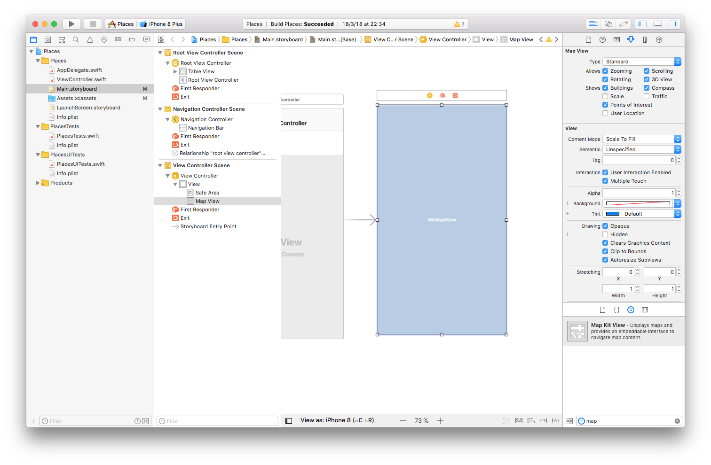

### Constraints

Constraints are the rules that allow for apps to work on different display sizes. This ensures that users have good experiences on apps whether they have an iPhone SE, iPhone 7, or iPhone X, without developers having to create custom layouts for each screen size. For example, you can make the map view stretch to fill the entire screen or just half the screen, without hardcoding any values based on model of phone.

To add constraints to our Map View, press the **Add Constraints** button in the bottom right of the centre panel.

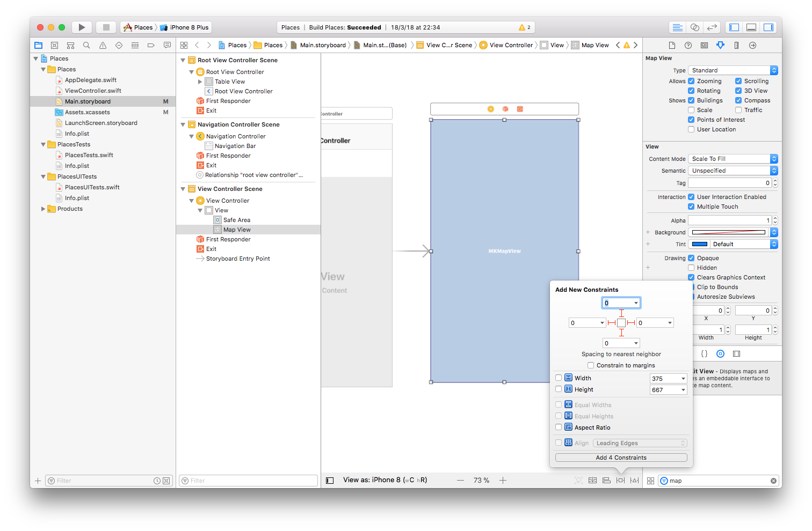

### Bar Buttons

Bar buttons are special buttons that you can add to the the navigation bar on the top of a view. For example, when you are in the Photos app, you can add an Album in the bar button in the top-left.

Add a **Bar Button Item** to the top-right of the **Root View Controller**. It should be a button with a label of 'Item'.

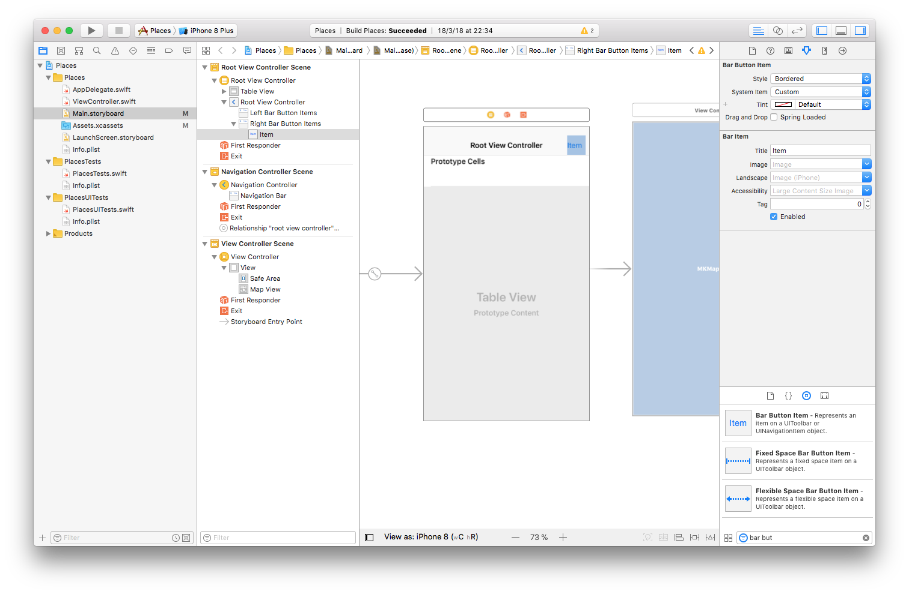

Next we're gonna make it an add (+) sign. Go to the **Attributes Inspector** in the right pane.

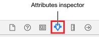

Change the **System item** value to _Add_. Now the button label should simply be '+'. This button will be used when we want to add a new location to our app.

### Segues

In order to move from one view to another — say from the main Settings page to General Settings – you need a segue between the views.

We are going to add a **Segue** from the Table View to the Map View when we press the Add button. This will allows us to add new places to our table.

To add the seque <kbd>ctrl</kbd> + <kbd>click</kbd> on the add button and drag to the Map View, you should see a blue line extend from the button.

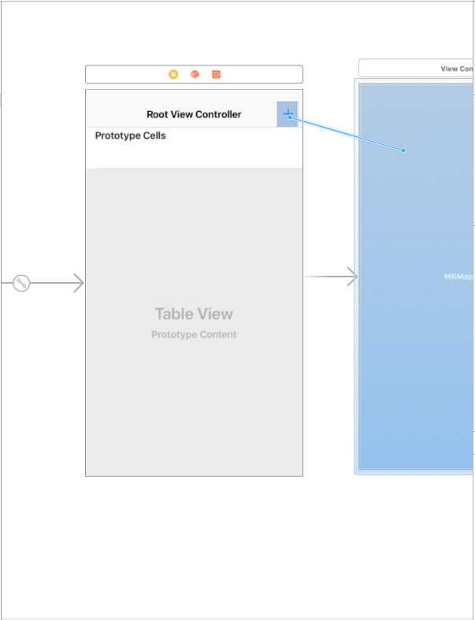

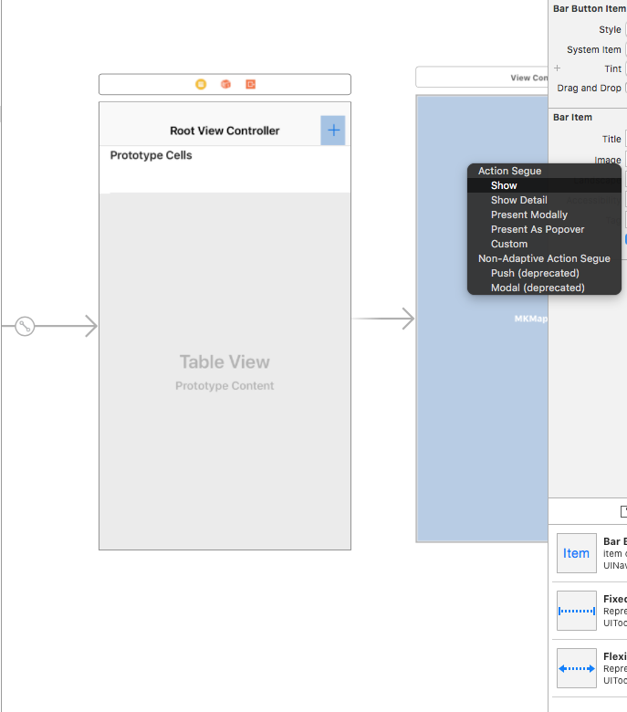

It should add a new arrow, from the Table View to the Map View, with a circle icon.

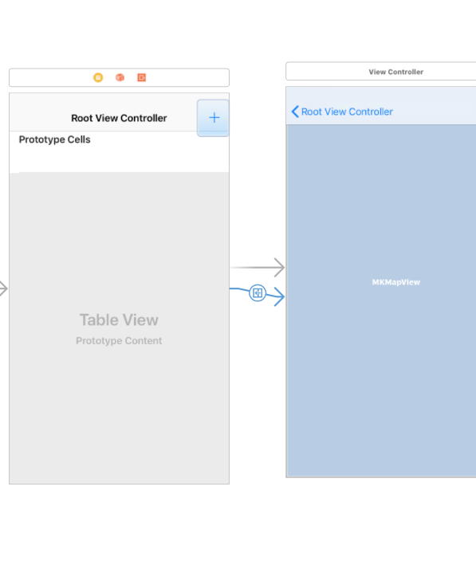

### Storyboard Entry Point

The **Storyboard Entry Point** defines which scene or view appears first in the 'story', in this case on app launch. You can see it as the arrow [without a symbol] next to the seque arrow.

Try pressing <kbd>command</kbd> + <kbd>r</kbd> to run our app.

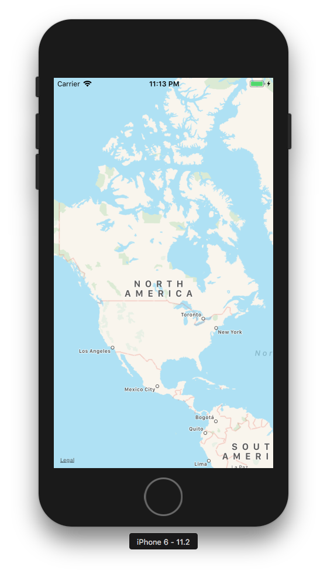

In order to change the entry point, you can simply drag-and-drop the arrow to the Navigation Controller.

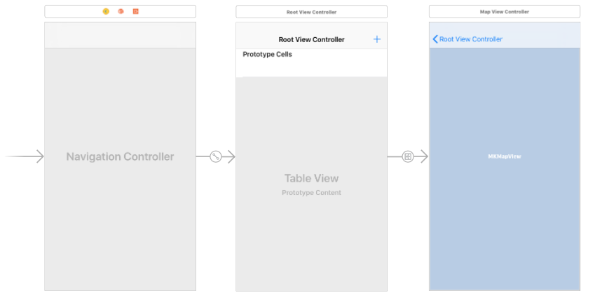

Now our app should open in the Table View. Try running the app again to confirm this. Try pressing the Add button and see what happens.

### Modifying the Default Names

Now that we have a basic working app, I think it's time to move on from the generic, undescriptive, default names.

First lets change the name that is displayed in the Table View title bar, since this is the first thing the user will see when they launch the app.

Click on the Root View Controller title [the navigation bar, which has the + button], and change the text to your app name. You can change the content of the **Navigation Item** [the app title bar] in the right panel after selecting it, in the Attributes Inspector.

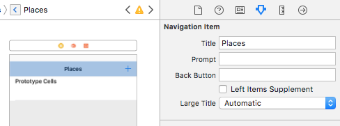

Next we want to change the classes of our View Controllers. We want to do this so we can define the logic for each of these views in the next section.

Select the bar on top of the Table View scene, and go to the identity inspector, and add a Custom Class name. It's best to make it something descriptive, so I went with TableViewController.

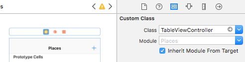

Now do the same with the View Controller.

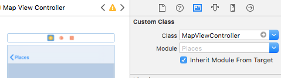

## View Controller Files

So we have now defined the UI of our app, but we have yet to create all the logic. We will add this logic in the View Controller swift files.

Xcode already added ViewController.swift file for us; we can use this one for the Map View. We need to create a new one for the Table View.

First go to ViewController.swift and change it's name to TableViewController.swift. You can do this by first selecting the file, and entering the new name in the File inspector on the right side.

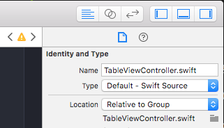

Now rename the **ViewController** Class to **TableViewController**. Change the parent class to **UITableViewController** also.

``` swift
class TableViewController: UITableViewController {
```

Now let's create a new View Controller file for our Map View.

### Add New View Controller File

To add a new View Controller file, right click on the app folder, and select _New File_.

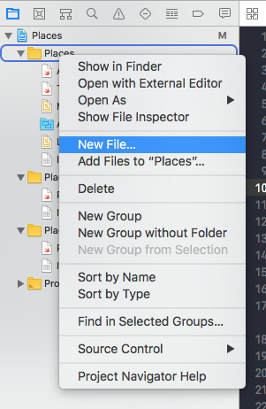

You will get a window asking you what type of file you want to create; we want to create a Cocoa Touch Class file.

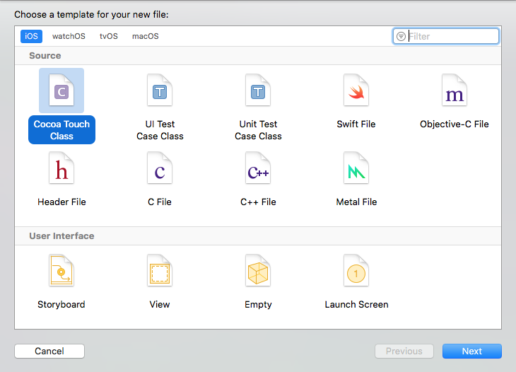

The next screen is for specifing the class name, and what subclass it is of. By default it will say NSObject, which is the topmost class [same as the Object class in Java].

Name your new class MapViewController, subclass of UIViewController. You can change the language to Objective-C, but we will stick with Swift.

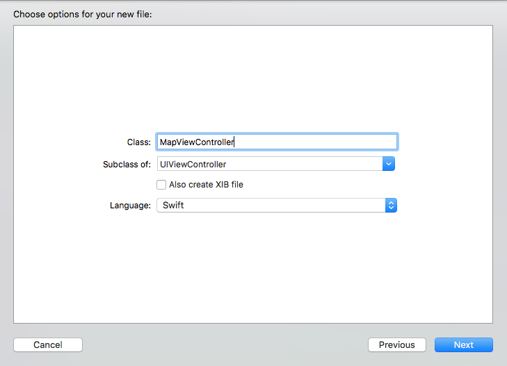

Press **Next**. A window will appear, to specify where to add this new file. The default location should be fine. Press **Create**.

### Add Button References

Now that we have files to store the logic for our view controllers, we need to add logic to them.

First let's add button references, so that we can use the buttons to trigger things, like adding user locations. To do this, we have to go back to the Storyboard.

_[sidenote: I added a clear button in the table view to delete all the locations]_

Adding button references to the View Controller files is as easy as simply dragging the button to where you want the reference.

Press the **Assistant Editor** button in the top right.

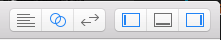

This will open up the View Controller logic for each selected scene. You might find it easier to hide the Navigator, Debug, and Utilities areas; you can use the buttons on the top right to do that, or you can use the shortcuts:

- Project Navigator: <kbd>command</kbd> + <kbd>0</kbd>
- Debug: <kbd>command</kbd> + <kbd>shift</kbd> + <kbd>y</kbd>
- Utilities: <kbd>command</kbd> + <kbd>option</kbd> + <kbd>0</kbd>

To add the Add button to our view controller, hold <kbd>ctrl</kbd> and drag the button over to the editor pane.

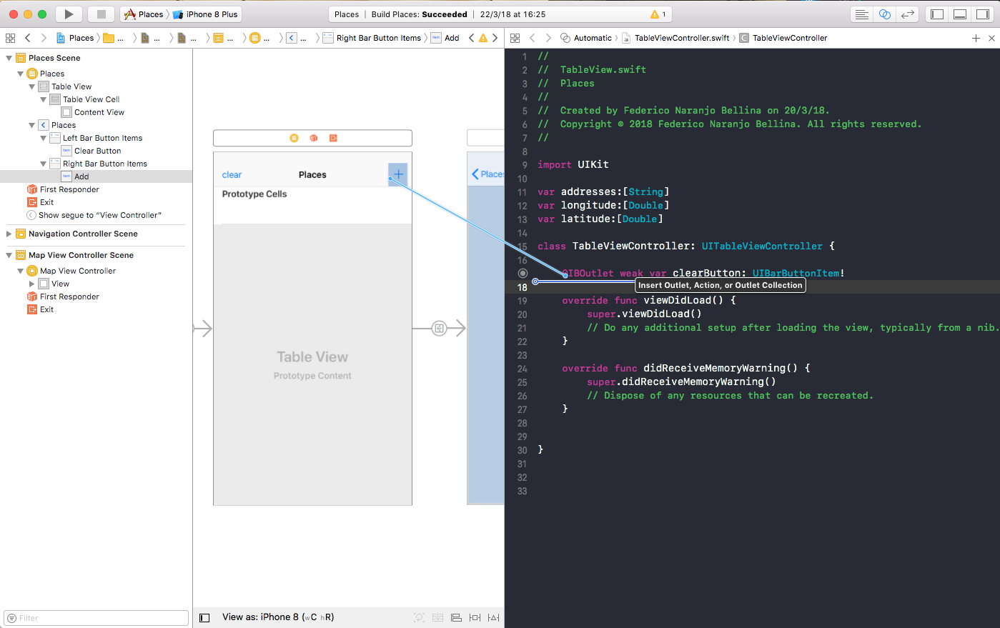

Place the reference somewhere that is not within a method.

You will be given the option to name your reference and change other characteristics about it. We want to leave it at the default values. Press **Connect**

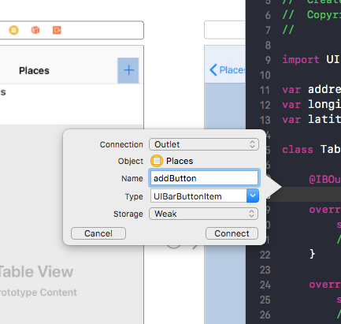

Now, moving on to the Map View Controller, let's add a button so we can add the current location on screen while in the Map View. To do this, add a **Navigation Item** to the Map View. Once you do this, you can add a **Navigation Bar Item**.

Now add the button reference the same way as before.

### Button Actions

In order to define logic to be executed when a button is pressed, we need to define an action. This is done in a very similar way to how we added the button reference. Instead, this time when giving the reference a name, also change the Connection type to from Outlet to **Action**. This will create a method that is triggered when the button is pressed.

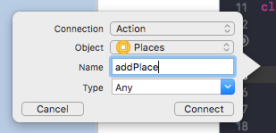