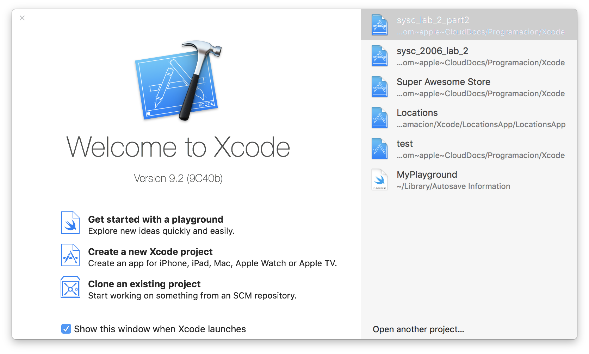
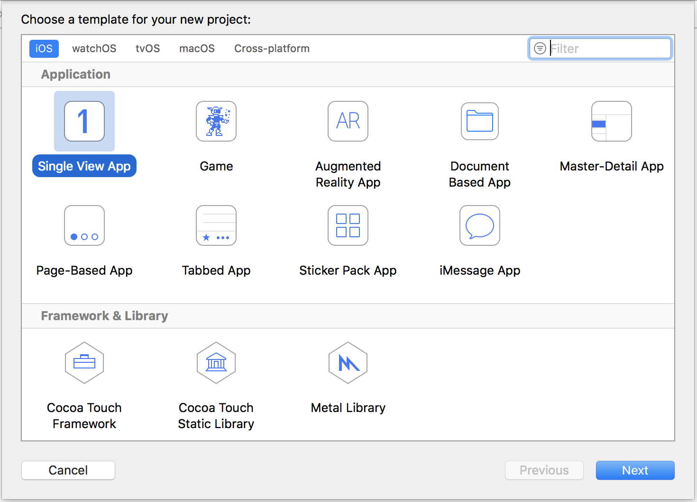
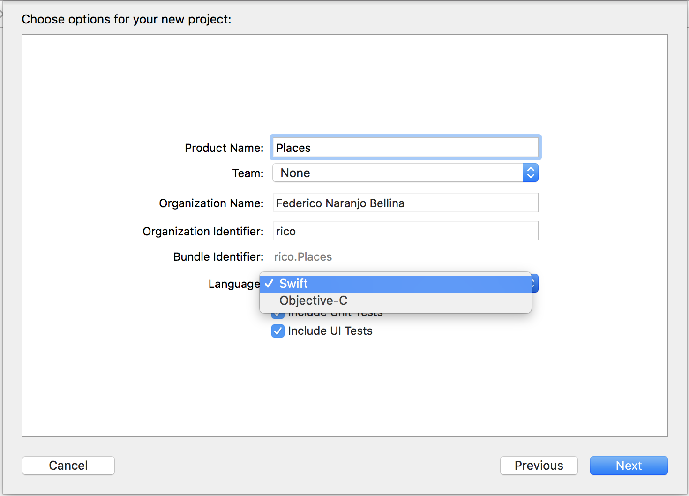
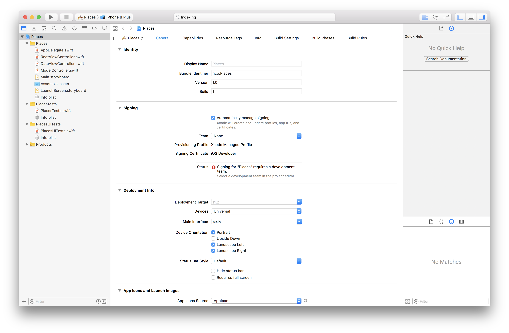
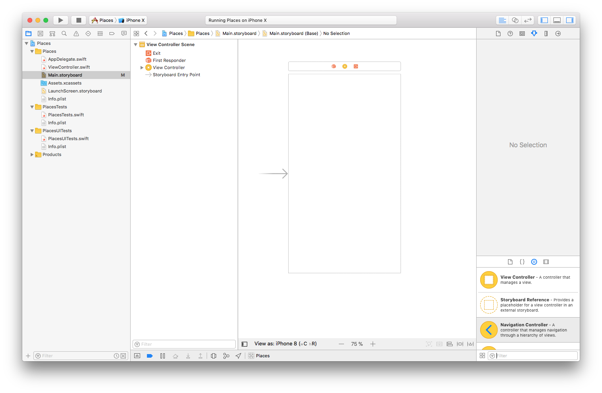
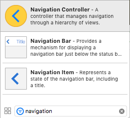
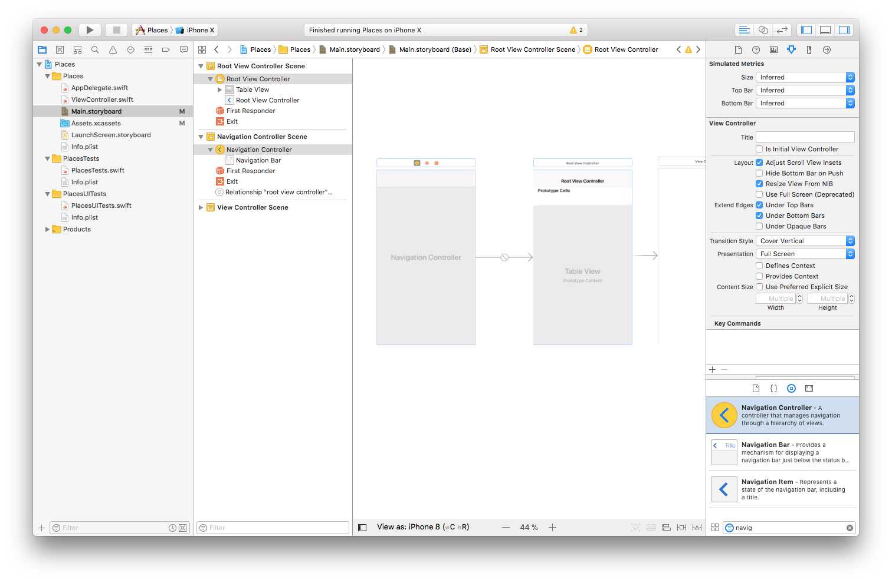

# Building a Basic iOS App

This workshop will teach you the basics about how to build a basic iOS app using Xcode IDE. First, we will go over how to set up Xcode, and creating a Single View application. This will allow you to create both the front-end and back-end of the application in one place, and then run your app on the included simulator or your own iPhone.

After creating your first app, we will expand on it by making use of other UI elements such as Buttons, ImageViews, TableViews, and MapViews.

## Things we will cover

- Setup Xcode + Create Project
- Create GUI in Storyboard
- Create Table view with basic logic
- Add Map view and show user's location
- Show map pin on long press
- Reverse Geocode location
- Add user's location to Table view
- Add long press location to Table view

## Setup

This section covers installing Xcode and creatng a single view application project.

### Installing Xcode

In order to install Xcode, you must first download it from the <a href="https://itunes.apple.com/ca/app/xcode/id497799835?mt=12">App Store</a>. It's a large 5.5 GB file so start the download and go grab a cup of coffee. Once it's done downloading you can the app; you will get a license agreement, press accept.

### Creating Xcode Project

Once you start Xcode you should get a welcome screen. If this window does not appear, or you closed it accidentally, you can press <kbd>cmd</kbd> + <kbd>shift</kbd> + <kbd>1</kbd>. Also, you can open it through the menubar option: **Window > Welcome to Xcode**.

Click on the button to create a new Xcode project, shown below. This project will contain all the files you need to build and run your iOS app.

The next screen should give you the options of which type of project you wish to create. We want to create a console line application so select the **Command Line Tool**.

In the next screen you can give your project a name and select the programming language you will be using. Make sure you select the correct one, because there is no way to change it after the project is created. With Xcode you have the option of using **Swift** or **Objective-C**. For our purposes I will use **Swift**. Press **Next**.

A window will appear asking where you want to situate the files; you can enable source control with Git, useful if you are also uploading to GitHub. Find a location where you want to keep your project and press **Create**.

### Introduction to Xcode

Your new project will now open in the _workspace window_. There is a lot of information on the screen, but you can ignore most of it for now. On the left side of Xcode, you will find the _navigator area_. In this pane you can see all of your files that belong to this project.

If you want more information on how to use Xcode, you can find a wonderful tutorial by Apple <a href="https://developer.apple.com/library/content/referencelibrary/GettingStarted/DevelopiOSAppsSwift/BuildABasicUI.html">here</a>.

## Reading the Storyboard

Select the file named **Main.storyboard**. This is the Storyboard for your new app.

The Storyboard allows you to create drag and drog UI elements so that you can design the look of your app visually — without having to code the location of every button and text field.

If you want to add a button, all you have to do is drag and drop; if you want to change the colours, you can select it from a colour wheel. This allows you to see what your app will look like without having to build and run everytime you make a change.

### Navigation Controller

View Controllers are what define what the user will see, and the behaviour of on-screen elements. The Navigation Controller manages a stack of view controllers, providing a drill-down interface. It is used in applications like the Setting app, where pressing an option in a Table takes you to another view, with a handy back button in the upper-left corner.

If you want more information about Navigation Controllers, you should look at Apple's official documentation on them <a href="https://developer.apple.com/library/content/documentation/WindowsViews/Conceptual/ViewControllerCatalog/Chapters/NavigationControllers.html">here</a>.

We will start by going to the bottom right search field and typing 'navigation'. The first result should be the Navigation  Controller. Now drag and drop this into the Storyboard workspace. It should look like two View Controllers next to each other.

### Bar Buttons

Bar buttons are special buttons that you can add the the navigation bar on the top of a view.

### Segues

In order to move from one view to another — say from the main Settings page to General Settings – you need a segue between the views.